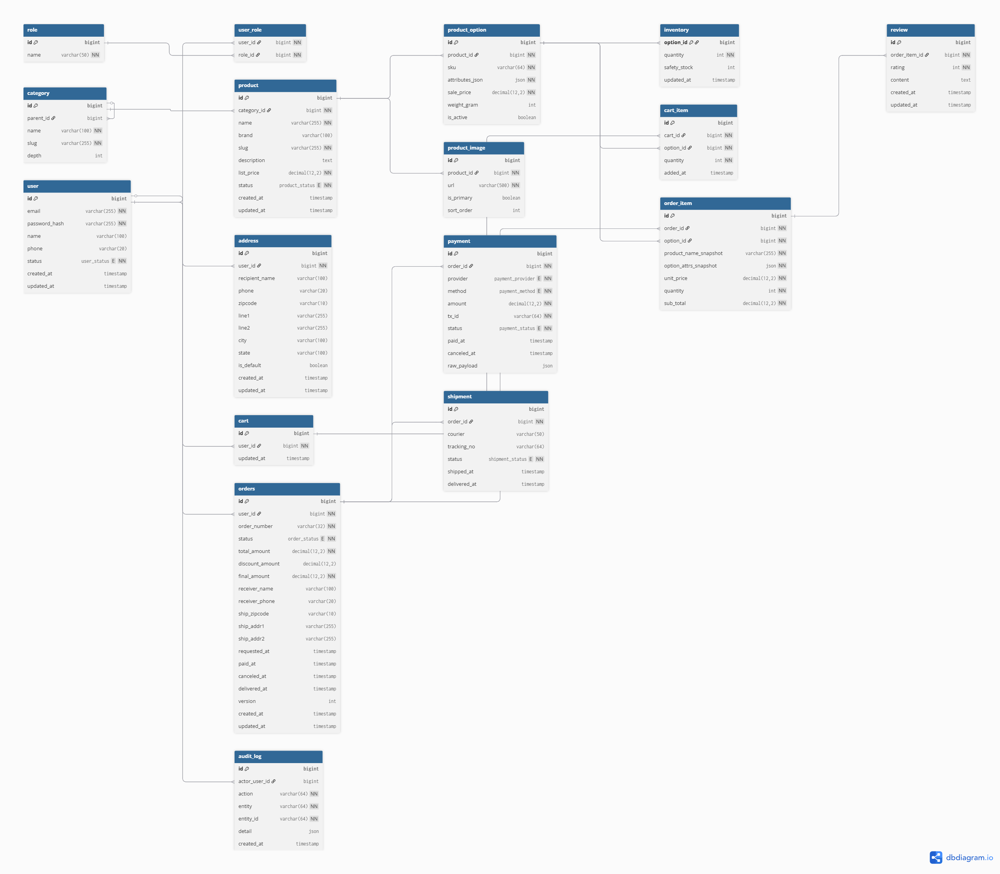

# DB 설계서
프로젝트: 농구공 쇼핑몰

## 1. ERD 다이어그램

## 2. 주요 테이블
- user: 회원 정보
- product: 상품 기본 정보
- product_option: 상품 옵션 (사이즈, 실내/실외)
- inventory: 옵션별 재고
- cart, cart_item: 장바구니
- orders, order_item: 주문/주문 항목
- payment: 결제
- shipment: 배송
- review: 리뷰 (테이블만 정의)

## 3. 관계 요약
- user 1:N orders
- product 1:N product_option
- product_option 1:1 inventory
- orders 1:N order_item
- order_item 0..1 review
