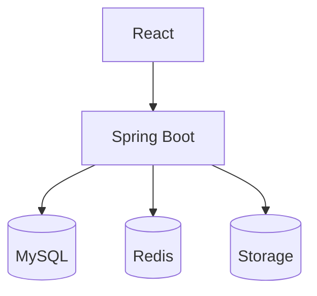

# 아키텍처 설계서 (요약) — 전자책 판매 사이트

---

## 1) 시스템 구성

---

## 2) 모듈 역할
- **user**: 회원가입/로그인, 역할 부여(ADMIN/USER)
- **catalog**: 전자책 등록/수정(관리자), 목록/상세/검색
- **cart**: 담기/수정/삭제, 사용자별 1개 장바구니
- **order**: 주문 생성, 아이템 가격/제목 스냅샷 저장
- **payment**: 결제 시뮬레이션(성공/실패) 후 주문 상태 갱신
- **download**: 구매 검증 → `download_token` 발급 → 서명 URL 반환
- **common**: JWT, 예외 필터, 로깅, 요청 추적

---

## 3) 데이터 저장소
- **MySQL**: 12개 테이블(ERD 참조)
- **Redis**: 세션/캐시, 다운로드 토큰 단기 캐싱(선택)
- **Object Storage**: 전자책 파일/썸네일 저장, 서버가 프록시 혹은 서명 URL 발급

---

## 4) 핵심 플로우
- **로그인**: 이메일/패스워드 → JWT 발급
- **구매**: 장바구니 → 주문 생성 → Mock 결제 성공 → `orders.status = PAID`
- **다운로드**:  
  1) 클라이언트가 `/download/{ebookId}/token` 호출  
  2) 서버가 “해당 유저가 구매했는지” 검증  
  3) `download_token` 발급(짧은 만료) 후 서명 URL 반환  
  4) 클라이언트는 해당 URL로 다운로드
---

## 5) 기술 스택
- **Backend**: Java 17, Spring Boot 3.3, Gradle, Flyway, Swagger(OpenAPI)
- **DB/Cache/Storage**: MySQL, Redis, Supabase Storage(또는 S3 호환)
- **CI/CD**: GitHub Actions (빌드/테스트/배포)

---

## 6) 보안 요약
- JWT 인증, BCrypt 비밀번호 해싱
- 다운로드는 **구매 검증 후 단기 서명 URL**만 제공
- 관리자 엔드포인트는 ROLE_ADMIN 필요
- 기본 Rate Limit(선택, Redis 기반)

---

## 7) 배포 요약
- 무료 클라우드 조합 예시:  
  - App: Render/Fly.io/Railway  
  - DB: Railway/MySQL Free  
  - Storage: Supabase Storage  
- 환경변수: `DB_URL, DB_USER, DB_PASS, JWT_SECRET, STORAGE_KEY/SECRET`

---

## 8) API 스켈레톤
- **Auth**: `POST /auth/signup`, `POST /auth/login`
- **Ebook**: `GET /ebooks`, `GET /ebooks/{id}`  
  - Admin: `POST /admin/ebooks`, `PUT /admin/ebooks/{id}`
- **Cart**: `GET /cart`, `POST /cart/items`, `PUT /cart/items/{id}`, `DELETE /cart/items/{id}`
- **Order/Payment**: `POST /orders`, `POST /orders/{id}/pay`
- **Download**: `POST /download/{ebookId}/token`, `GET /download/{token}`
- **Review**(선택): `POST /reviews`, `PUT /reviews/{id}`, `DELETE /reviews/{id}`

---

## 9) 마이그레이션 배치(Flyway)
- V1: users, roles, user_roles
- V2: ebook, ebook_file
- V3: cart, cart_item
- V4: orders, order_item, payment
- V5: download_token, review

---
## 인증/권한 아키텍처 (JWT)

### 선택 배경
- 서버 세션을 사용하지 않는 Stateless 구조 채택
- 프론트엔드(React)와 백엔드(Spring Boot)를 분리한 구조
- API 서버 확장 시 인증 처리 단순화 목적

### 구성 요소
- Frontend
  - LoginPage: 사용자 로그인 요청
  - axios interceptor(api.js): 모든 API 요청에 Authorization 헤더 자동 첨부
  - PrivateRoute / AdminRoute: 화면 단 접근 제어

- Backend
  - JwtProvider: JWT 생성/검증/Claim 파싱
  - JwtAuthFilter: 요청 헤더에서 JWT 검증 후 SecurityContext에 인증 정보 주입
  - SecurityConfig: URL 별 접근 정책 설정

### 인증 흐름
1. 사용자가 로그인 화면에서 이메일/비밀번호 입력
2. POST /auth/login 요청
3. 서버에서 사용자 인증 후 JWT(accessToken) 발급
4. 프론트엔드 localStorage에 accessToken 저장
5. 이후 API 요청 시 Authorization: Bearer <token> 자동 첨부
6. 서버에서 JWT 검증 후 권한(Role)에 따라 접근 허용/차단

### 권한 정책
- PUBLIC: /auth/**, GET /ebooks/**
- AUTHENTICATED: /cart/**, /orders/**
- ADMIN ONLY: /admin/**
